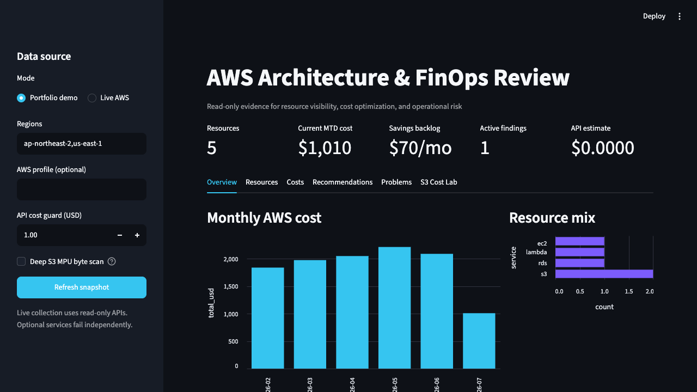
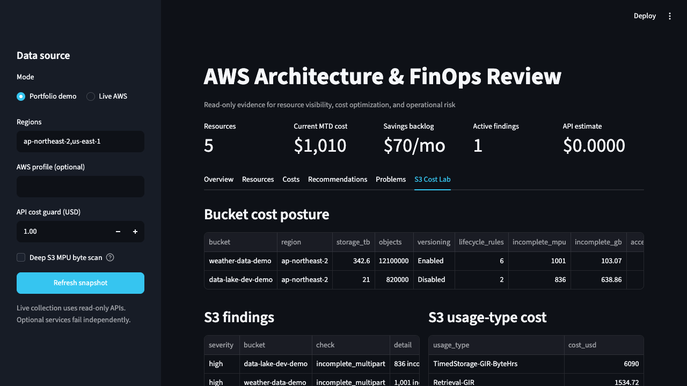

# AWS Architecture & FinOps Review

Solutions Architect 포트폴리오를 위한 **읽기 전용 AWS 진단 대시보드**입니다. 여러 리전의 리소스, 비용 추세, AWS 추천, 운영 이상 신호와 S3 스토리지 비용을 한 화면에서 검토합니다.





## 확인할 수 있는 내용

- 어떤 AWS 리소스가 어느 리전에 존재하는가?
- 최근 6개월 비용은 어떻게 변했고 어떤 서비스가 지배적인가?
- Cost Optimization Hub가 제안하는 월 절감액과 실행 난이도는 무엇인가?
- 현재 ALARM 상태나 EC2 상태 이상이 있는가?
- 서브넷마다 실제로 무엇이 들어 있고, 그중 어느 것이 인터넷에 열려 있는가?
- 이름이 비슷한 서브넷과 같은 이름을 쓰는 라우팅 테이블을 어떻게 구분하는가?
- S3 비용이 저장, 인출, 요청 중 어디에서 발생하는가?
- 미완료 멀티파트, noncurrent version, lifecycle 누락이 있는가?
- Standard / Standard-IA / Glacier Instant Retrieval / Intelligent-Tiering 중 무엇이 유리한가?

## Docker로 대시보드 실행

```bash
docker compose up --build -d
docker compose ps
```

브라우저에서 `http://127.0.0.1:8501`을 여세요. 처음 실행해 DB가 비어 있으면 `포트폴리오 예시`를 보여줍니다. `실제 AWS 계정`을 선택하고 **지금 조회**를 눌러야 AWS API를 호출하며, 정상 조회 결과는 SQLite에 저장됩니다. 이후 컨테이너를 재시작해도 마지막 실계정 스냅샷을 DB에서 읽으므로 AWS를 다시 조회하지 않습니다.

로컬 AWS 설정과 SSO 캐시는 컨테이너의 `/root/.aws`에 읽기 전용으로 연결됩니다. 이름 있는 프로필을 기본값으로 쓰려면 다음처럼 실행합니다.

```bash
AWS_PROFILE=my-readonly docker compose up --build -d
```

화면의 `AWS 프로필 이름`에 입력해도 됩니다. 액세스 키를 DB에 저장하지 않으며, 실계정 조회 결과만 이름 있는 Docker 볼륨 `aws-tools_aws-dashboard-data`의 `/data/aws-tools.db`에 보관합니다.

### 컨테이너 로그와 DB 확인

```bash
# 요청, AWS 조회 시작·성공·실패, DB 스냅샷 저장 로그
docker compose logs -f dashboard

# 저장된 스냅샷 요약 확인
docker compose exec dashboard python -c "import sqlite3; db=sqlite3.connect('/data/aws-tools.db'); print(db.execute('select id, generated_at, resource_count, recommendation_count, problem_count from snapshots order by id desc').fetchall())"

# 컨테이너만 중지·삭제 — DB 볼륨은 유지
docker compose down

# DB까지 완전히 삭제할 때만 사용
docker compose down -v
```

로그는 최대 10MB 파일 3개로 순환합니다. 대시보드는 로컬 PC에서만 열리도록 `127.0.0.1:8501`에 바인딩되어 있습니다.

### Docker 없이 개발 실행

```bash
python3 -m venv .venv
source .venv/bin/activate
pip install -r requirements-dashboard.txt
python dashboard.py
```

이 경우 SQLite 기본 경로는 `data/aws-tools.db`입니다. `AWS_DASHBOARD_DB` 환경 변수로 바꿀 수 있습니다.

화면은 Flask, Gunicorn, HTML/CSS와 최소 JavaScript로 동작합니다. 대시보드 실행 경로에서는 Streamlit, Pandas, 별도 차트 라이브러리를 사용하지 않습니다. 컨테이너는 AWS 조회 중에도 상태 확인에 응답하도록 단일 worker·2개 thread와 300초 요청 제한을 사용합니다.

### JSON 수집기

```bash
# AWS 호출 없는 데모 리포트
python aws_audit.py --demo

# 기본 읽기 전용 점검
python aws_audit.py --profile my-readonly --region ap-northeast-2 --region us-east-1

# 미완료 multipart의 모든 part 크기까지 계산
python aws_audit.py --profile my-readonly --s3-depth deep --max-api-cost 1.00
```

`--max-api-cost`는 Cost Explorer, CloudWatch, S3 LIST 호출의 보수적 상한입니다. 실제 청구서 계산기가 아니라, 깊은 스캔이 설정 금액을 넘기 전에 중단시키는 안전장치입니다.

## 점검 범위

| 목적 | 2026 AWS source | 구현 |
|---|---|---|
| 리소스 인벤토리 | AWS Resource Explorer | 전체 검색, EC2/RDS/Lambda fallback |
| 비용 추세 | AWS Cost Explorer | 월별·서비스별 6개월 비용 |
| 비용 이상 | AWS Cost Anomaly Detection | 최근 90일 anomaly |
| 절감 백로그 | AWS Cost Optimization Hub | 절감액, 노력, restart/rollback |
| 운영 문제 | CloudWatch + EC2 status | ALARM, instance/system check, scheduled event |
| 네트워크 토폴로지 | EC2 network read-only APIs | VPC·서브넷·라우팅 테이블·게이트웨이·피어링·엔드포인트, ENI 기반 서브넷 점유 |
| S3 용량 | S3 daily CloudWatch metrics | bucket·storage class·object count |
| S3 구조 | S3 read-only APIs | versioning, lifecycle, logging, incomplete MPU |
| S3 비용 | Cost Explorer usage type | 저장·인출·요청 비용 분해 |
| S3 클래스 선택 | TCO simulator | 용량·객체 수·읽기 빈도·cold 비율 비교 |

Compute Optimizer는 Cost Optimization Hub가 수집하는 주요 추천 소스이므로 동일 추천을 별도 API로 중복 수집하지 않습니다. 조직 규모의 상세 원가 배부는 AWS Data Exports + QuickSight/CUDOS가 더 적합합니다.

## 안전성

- 읽기 전용 IAM 정책: [`iam-policy.json`](iam-policy.json)
- 쓰기·삭제·lifecycle 변경 API 없음
- 객체 본문 `GetObject` 호출 없음; Glacier retrieval을 유발하지 않음
- 선택 서비스가 미등록/권한 부족이어도 나머지 섹션은 계속 수집
- 실계정 ID, ARN, bucket 이름은 데모 데이터에 포함하지 않음

## 검증

```bash
python -m unittest discover -s tests -v
python -m py_compile aws_audit.py dashboard.py dashboard_app/__init__.py dashboard_app/presentation.py dashboard_app/storage.py
python aws_audit.py --demo --output /tmp/aws-tools-demo.json
docker compose config
```

설계 근거는 [`docs/architecture.md`](docs/architecture.md), S3 분석 방법은 [`docs/s3-cost-review.md`](docs/s3-cost-review.md)를 참고하세요.

기존 `ec2_analyzer.py`, `rds_analyzer.py`는 상세 CloudWatch 통계 분석용으로 유지됩니다. 새 대시보드는 계정 전체의 우선순위를 찾고, 기존 분석기는 선택한 EC2/RDS를 깊게 확인하는 2단계 구조입니다.
