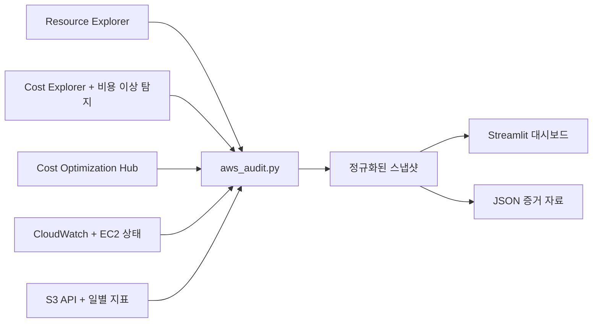

# 아키텍처 결정 기록 — 2026 AWS 검토 도구

## 결과

한 번의 읽기 전용 수집으로 `리소스 목록 → 비용 → 최적화 추천 → 운영 이상 신호 → S3 상세 분석` 흐름을 만든다. 대시보드는 의사결정의 시작점이며 AWS 설정을 자동으로 변경하지 않는다.

## 2026년 기준으로 이 AWS 도구를 선택한 이유

| 도구 | 역할 | 선택 근거 |
|---|---|---|
| Resource Explorer | 서비스 간 리소스 검색 | 기본 리소스 목록 수집 수단이다. View나 권한이 없을 때만 개별 서비스 API를 제한적으로 사용한다. |
| Cost Explorer | 비용 및 사용량 조회 API | 최근 6개월 추세와 S3 사용 유형별 비용을 분석한다. 조회 요청에 비용이 발생하므로 호출 수를 최소화한다. |
| Cost Anomaly Detection | 예상 밖 비용 증가 탐지 | 자체 임계값 모델을 만들지 않고 AWS가 탐지한 최근 비용 이상을 가져온다. |
| Cost Optimization Hub | 계정 조건이 반영된 통합 추천 | 비용 최적화 작업 목록의 기준으로 사용한다. Compute Optimizer 등의 결과를 통합하고 계정별 상업 조건을 반영한다. |
| Compute Optimizer | 사용률 기반 크기 조정 및 유휴 리소스 탐지 | 첫 버전에서는 동일한 API를 중복 호출하지 않는다. Cost Optimization Hub에서 통합 결과를 보여주고, 예상 지표는 AWS 상세 화면에서 확인한다. |
| CloudWatch | 운영 상태 확인 | 활성 경보와 S3 일별 저장 지표를 수집한다. 기존 EC2/RDS 분석기는 선택한 리소스의 상세 지표 분석에 사용한다. |
| S3 Storage Lens | 조직 규모의 스토리지 분석 | 접두사별 추세, 수십억 개 객체 또는 조직 전체 분석이 필요할 때 사용하는 확장 경로다. 현재 로컬 스캔은 포트폴리오 시연 범위를 담당한다. |
| AWS Data Exports + Cost and Usage Dashboard | 정기 FinOps 데이터셋 및 대시보드 | 상세 원가 배부, 장기 보관, QuickSight 공유, RI/SP 분석과 조직 단위 보고가 필요할 때 확장한다. |

## 실패 처리 방식

선택형 AWS 서비스는 사전 등록, View, 지원 플랜 또는 추가 IAM 권한이 필요할 수 있다. 각 수집 영역은 AWS 오류를 독립적으로 처리하고 `errors`에 기록한다. 한 서비스가 비활성화되어도 다른 영역의 수집 결과는 유지한다.

## 비용 및 안전 모델

- 실계정 수집은 사용자가 실행한 경우에만 시작하며, 데모 모드는 AWS API를 호출하지 않는다.
- `ApiBudget`은 비용이 발생하거나 호출량이 많은 API를 실행하기 전에 보수적인 예상 비용을 예약한다.
- S3 기본 모드는 미완료 멀티파트 업로드 목록만 확인하고 각 파트는 열거하지 않는다.
- S3 상세 모드는 미완료 파트 크기를 계산하며, 설정된 비용 한도에 도달하기 전에 중단한다.
- 수집기에는 `GetObject`, 복원, 삭제, 멀티파트 중단, 라이프사이클 변경 또는 리소스 변경 API가 없다.

## 알려진 제한 사항

- Resource Explorer의 View와 색인 지원 리소스 유형에 따라 기본 리소스 목록 범위가 결정된다.
- Cost Explorer의 이번 달 비용은 추정값이며 아직 확정되지 않은 사용량이 있을 수 있다.
- Cost Optimization Hub와 Cost Anomaly Detection은 사전 등록이나 설정이 완료되어야 결과를 반환한다.
- S3 일별 지표는 하루 이상 늦게 반영될 수 있다.
- 서버 액세스 로깅을 활성화하기 전에 발생한 객체 읽기는 나중에 복원할 수 없다.
- TCO 기본값은 서울 리전의 특정 시점 기준값이며 실시간 요금 API가 아니다. 대시보드에서 모든 요금 가정을 수정할 수 있다.
