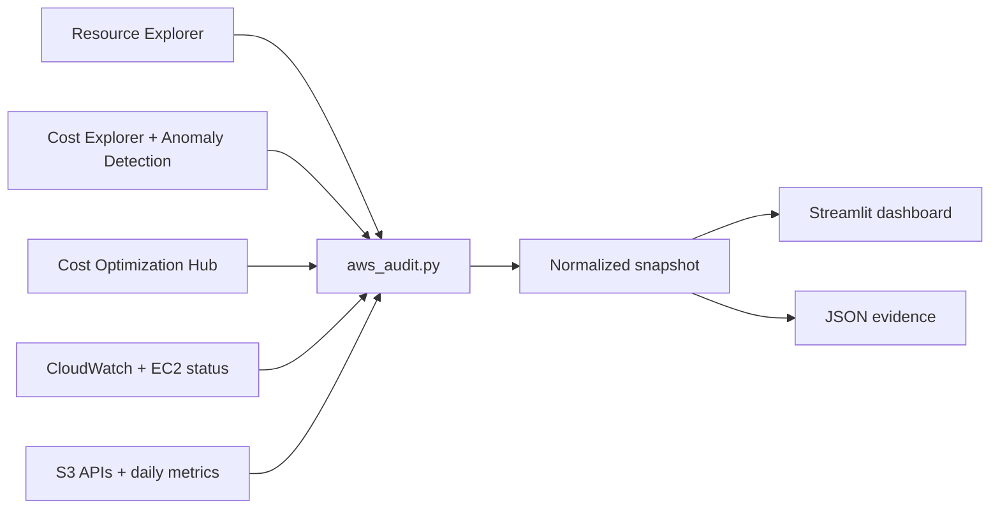

# Architecture decision record — 2026 AWS review toolkit

## Outcome

한 번의 읽기 전용 수집으로 `Inventory → Cost → Recommendation → Operational signal → S3 deep dive` 흐름을 만든다. 대시보드는 의사결정의 시작점이며 AWS 설정을 자동 변경하지 않는다.

## Why these AWS tools in 2026

| Tool | Role | Decision |
|---|---|---|
| Resource Explorer | Cross-service resource search | Primary inventory. Direct service APIs are a limited fallback when views/permissions are unavailable. |
| Cost Explorer | Interactive cost and usage API | Six-month trend and S3 usage-type analysis. Keep calls few because queries are chargeable. |
| Cost Anomaly Detection | Unexpected spend detection | Pull recent anomalies instead of inventing a local threshold model. |
| Cost Optimization Hub | Consolidated account-aware recommendations | Primary optimization backlog. It aggregates sources such as Compute Optimizer and considers commercial terms. |
| Compute Optimizer | Utilization-based rightsizing and idle findings | Do not duplicate its APIs in v1; surface consolidated results through Cost Optimization Hub. Use native detail pages for metric projections. |
| CloudWatch | Operational state | Active alarms plus S3 daily storage metrics. Existing EC2/RDS analyzers remain the metric deep dive. |
| S3 Storage Lens | Organization-scale storage analytics | Recommended native upgrade when prefix trends, billions of objects, or org-wide metrics are needed. Local scan covers the portfolio demonstration. |
| AWS Data Exports + Cost and Usage Dashboard | Scheduled FinOps dataset/dashboard | Upgrade path for detailed allocation, long retention, QuickSight sharing, RI/SP reporting, and organization reporting. |

## Failure model

Optional AWS services require enrollment, views, support level, or additional IAM. Each section catches its own AWS error and appends it to `errors`; one unavailable service must not erase evidence from the others.

## Cost and safety model

- Live collection is user-triggered; demo mode performs no AWS calls.
- `ApiBudget` reserves a conservative amount before chargeable/query-heavy calls.
- Basic S3 mode lists incomplete uploads but does not enumerate their parts.
- Deep mode enumerates parts to calculate exact stranded bytes and stops at the configured cost guard.
- No `GetObject`, restore, delete, abort, lifecycle write, or resource mutation API exists in the collector.

## Known limits

- Resource Explorer views and indexed resource types determine primary inventory coverage.
- Cost Explorer current-month values are estimated and incomplete.
- Cost Optimization Hub and Cost Anomaly Detection return no data until enrolled/configured.
- S3 daily metrics can lag by one or more days.
- Server access logging cannot reconstruct reads that occurred before logging was enabled.
- TCO defaults are a dated Seoul-region baseline, not a live price API. The dashboard exposes every price assumption.
